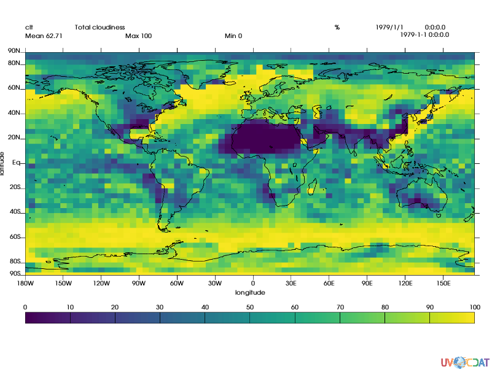
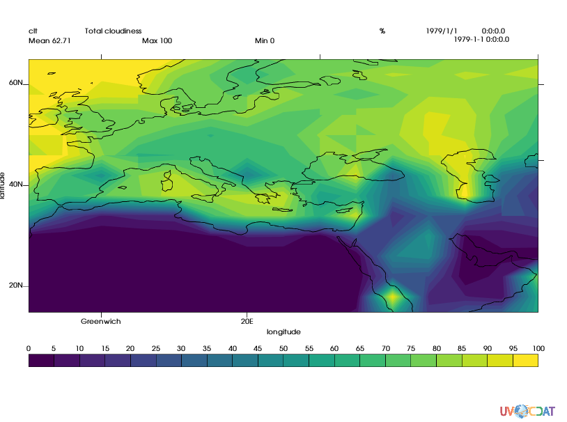
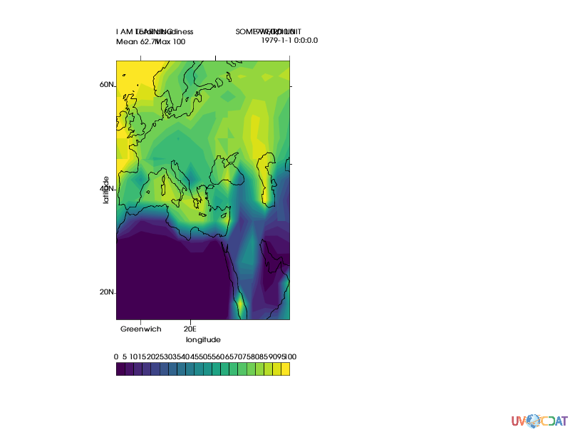
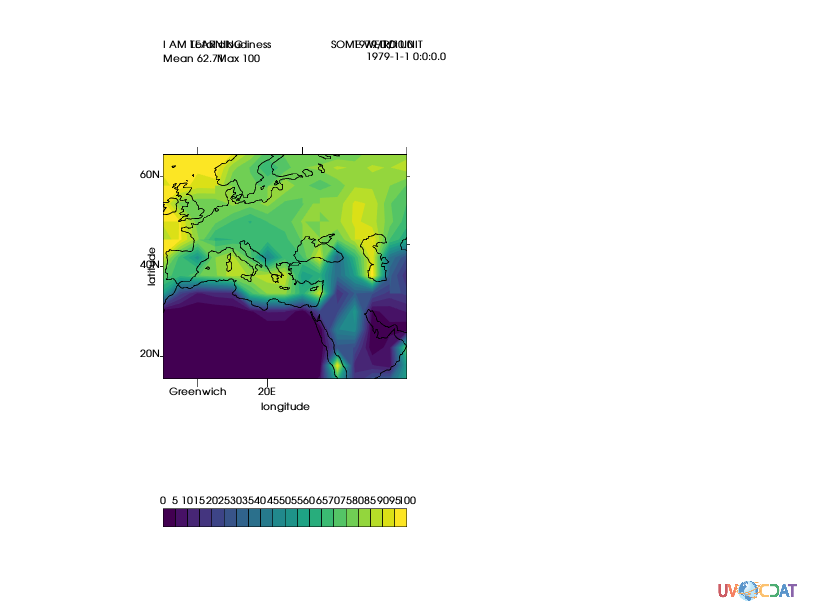

# Basic VCS Tutorial
[download iPython Notebook](Basic_VCS_demo.ipynb)


```python
import vcs
import cdms2
```


```python
# MAke sure sample data is here
vcs.download_sample_data_files()
```


```python
f=cdms2.open(vcs.sample_data+"/clt.nc")
```


```python
# LOAS SAMPLE DATA
s=f("clt")
```


```python
# Create vcs canvas (basically X window to draw in)
x=vcs.init()
```


```python
# plot data as is
```


```python
#because we are in jupyter using bg=True to plot thing in background (no flashing on your screen)
bg=True
x.plot(s,bg=bg)
```





```python
# Now let's explore some graphics methods available
print vcs.listelements()
```

    ['1d', '3d_dual_scalar', '3d_scalar', '3d_vector', 'boxfill', 'colormap', 'display', 'fillarea', 'font', 'fontNumber', 'isofill', 'isoline', 'line', 'list', 'marker', 'meshfill', 'projection', 'scatter', 'taylordiagram', 'template', 'textcombined', 'textorientation', 'texttable', 'vector', 'xvsy', 'xyvsy', 'yxvsx']


```python
# Let's create a isofill
gm = vcs.createisofill()
```


```python
# Let's see what we can set/do with this
gm.list()
```

     ----------Isofill (Gfi) member (attribute) listings ----------
    graphics method = Gfi
    name = __isofill_47070857589361
    projection = linear
    xticlabels1 = *
    xticlabels2 = *
    xmtics1 = 
    xmtics2 = 
    yticlabels1 = *
    yticlabels2 = *
    ymtics1 =  
    ymtics2 =  
    datawc_x1 = 1e+20
    datawc_y1 =  1e+20
    datawc_x2 =  1e+20
    datawc_y2 =  1e+20
    datawc_timeunits =  days since 2000
    datawc_calendar =  135441
    xaxisconvert =  linear
    yaxisconvert =  linear
    missing =  (0.0, 0.0, 0.0, 100.0)
    ext_1 =  False
    ext_2 =  False
    fillareastyle =  solid
    fillareaindices =  [1, 1, 1, 1, 1, 1, 1, 1, 1, 1, 1, 1, 1, 1, 1, 1, 1, 1, 1, 1]
    fillareacolors =  [1]
    fillareaopacity =  [None, None, None, None, None, None, None, None, None, None, None, None, None, None, None, None, None, None, None, None]
    levels =  ([1.0000000200408773e+20, 1.0000000200408773e+20],)
    legend =  None


The Graphic Method Controls How Things are Drawn
datawc stands for **dataw**orld**c**oordinates
x/yticlabels are the labels to useon x/y axes (python dictionaries {location_value:"string"}
x/ymtics are the ticks w/o strings
missing is color to use for misssing values (index in colormap, (r,g,b,o) or "string")
fillarea are the contour properties


```python
gm.datawc_x1 = -10
gm.datawc_x2 = 60
gm.datawc_y1= 15
gm.datawc_y2 = 65

gm.xticlabels1 = {0:"Greenwich", 20:"20E"}
gm.yticlabels2 = {0:"Equator",60:"Arctic Circle", 45:"45N"}

levels = range(0,101,5) # iso contours to use
colors = vcs.getcolors(levels) # automatically picks colors spread accross your color map
gm.levels = levels
gm.fillareacolors = colors

x.clear()
x.plot(s,gm,bg=bg)
```





```python
# now to control the LOCATION of elements we use a *template*
t = vcs.createtemplate()
```


```python
# t.list() would list all properties we can set
t.list()
```

    ----------Template (P) member (attribute) listings ----------
    method = P
    name = __template_210241759330535
    orientation = 0
    member =  file
         priority = 1
         x = 0.0500000007451
         y = 0.0130000002682
         texttable = default
         textorientation = default
    member =  function
         priority = 1
         x = 0.0500000007451
         y = 0.0130000002682
         texttable = default
         textorientation = default
    member =  logicalmask
         priority = 1
         x = 0.0500000007451
         y = 0.0329999998212
         texttable = default
         textorientation = default
    member =  transformation
         priority = 1
         x = 0.0500000007451
         y = 0.0529999993742
         texttable = default
         textorientation = default
    member =  source
         priority = 1
         x = 0.0500000007451
         y = 0.941999971867
         texttable = default
         textorientation = default
    member =  dataname
         priority = 1
         x = 0.0500000007451
         y = 0.922999978065
         texttable = default
         textorientation = default
    member =  title
         priority = 1
         x = 0.15000000596
         y = 0.922999978065
         texttable = default
         textorientation = default
    member =  units
         priority = 1
         x = 0.670000016689
         y = 0.922999978065
         texttable = default
         textorientation = default
    member =  crdate
         priority = 1
         x = 0.75
         y = 0.922999978065
         texttable = default
         textorientation = default
    member =  crtime
         priority = 1
         x = 0.850000023842
         y = 0.922999978065
         texttable = default
         textorientation = default
    member =  comment1
         priority = 1
         x = 0.10000000149
         y = 0.954999983311
         texttable = default
         textorientation = default
    member =  comment2
         priority = 1
         x = 0.10000000149
         y = 0.975000023842
         texttable = default
         textorientation = default
    member =  comment3
         priority = 1
         x = 0.10000000149
         y = 0.995000004768
         texttable = default
         textorientation = default
    member =  comment4
         priority = 1
         x = 0.10000000149
         y = 0.999000012875
         texttable = default
         textorientation = default
    member =  xname
         priority = 1
         x = 0.5
         y = 0.21
         texttable = default
         textorientation = defcenter
    member =  yname
         priority = 1
         x = 0.006
         y = 0.56
         texttable = default
         textorientation = defup
    member =  zname
         priority = 0
         x = 0.0
         y = 0.995000004768
         texttable = default
         textorientation = default
    member =  tname
         priority = 1
         x = 0.0
         y = 0.995000004768
         texttable = default
         textorientation = default
    member =  xunits
         priority = 1
         x = 0.600000023842
         y = 0.277000010014
         texttable = default
         textorientation = default
    member =  yunits
         priority = 1
         x = 0.019999999553
         y = 0.658999979496
         texttable = default
         textorientation = default
    member =  zunits
         priority = 0
         x = 0.0
         y = 0.995000004768
         texttable = default
         textorientation = default
    member =  tunits
         priority = 0
         x = 0.0
         y = 0.995000004768
         texttable = default
         textorientation = default
    member =  xvalue
         priority = 1
         x = 0.800000011921
         y = 0.941999971867
         format = default
         texttable = default
         textorientation = default
    member =  yvalue
         priority = 1
         x = 0.800000011921
         y = 0.922999978065
         format = default
         texttable = default
         textorientation = default
    member =  zvalue
         priority = 1
         x = 0.800000011921
         y = 0.902999997139
         format = default
         texttable = default
         textorientation = default
    member =  tvalue
         priority = 1
         x = 0.800000011921
         y = 0.883000016212
         format = default
         texttable = default
         textorientation = default
    member =  mean
         priority = 1
         x = 0.0500000007451
         y = 0.899999976158
         format = default
         texttable = default
         textorientation = default
    member =  min
         priority = 1
         x = 0.449999988079
         y = 0.899999976158
         format = default
         texttable = default
         textorientation = default
    member =  max
         priority = 1
         x = 0.25
         y = 0.899999976158
         format = default
         texttable = default
         textorientation = default
    member =  xtic1
         priority = 1
         y1 = 0.259999990463
         y2 = 0.24699999392
         line = default
    member =  xtic2
         priority = 1
         y1 = 0.860000014305
         y2 = 0.871999979019
         line = default
    member =  xmintic1
         priority = 0
         y1 = 0.259999990463
         y2 = 0.256999999285
         line = default
    member =  xmintic2
         priority = 0
         y1 = 0.860000014305
         y2 = 0.860000014305
         line = default
    member =  ytic1
         priority = 1
         x1 = 0.0500000007451
         x2 = 0.0399999991059
         line = default
    member =  ytic2
         priority = 1
         x1 = 0.949999988079
         x2 = 0.959999978542
         line = default
    member =  ymintic1
         priority = 0
         x1 = 0.0500000007451
         x2 = 0.0450000017881
         line = default
    member =  ymintic2
         priority = 0
         x1 = 0.949999988079
         x2 = 0.954999983311
         line = default
    member =  xlabel1
         priority = 1
         y = 0.234999999404
         texttable = default
         textorientation = defcenter
    member =  xlabel2
         priority = 0
         y = 0.870000004768
         texttable = default
         textorientation = defcenter
    member =  ylabel1
         priority = 1
         x = 0.0399999991059
         texttable = default
         textorientation = defright
    member =  ylabel2
         priority = 0
         x = 0.959999978542
         texttable = default
         textorientation = default
    member =  box1
         priority = 1
         x1 = 0.0500000007451
         y1 = 0.259999990463
         x2 = 0.949999988079
         y2 = 0.860000014305
         line = default
    member =  box2
         priority = 0
         x1 = 0.0
         y1 = 0.300000011921
         x2 = 0.920000016689
         y2 = 0.879999995232
         line = default
    member =  box3
         priority = 0
         x1 = 0.0
         y1 = 0.319999992847
         x2 = 0.910000026226
         y2 = 0.860000014305
         line = default
    member =  box4
         priority = 0
         x1 = 0.0
         y1 = 0.0
         x2 = 0.0
         y2 = 0.0
         line = default
    member =  line1
         priority = 0
         x1 = 0.0500000007451
         y1 = 0.560000002384
         x2 = 0.949999988079
         y2 = 0.560000002384
         line = default
    member =  line2
         priority = 0
         x1 = 0.5
         y1 = 0.259999990463
         x2 = 0.5
         y2 = 0.860000014305
         line = default
    member =  line3
         priority = 0
         x1 = 0.0
         y1 = 0.52999997139
         x2 = 0.899999976158
         y2 = 0.52999997139
         line = default
    member =  line4
         priority = 0
         x1 = 0.0
         y1 = 0.990000009537
         x2 = 0.899999976158
         y2 = 0.990000009537
         line = default
    member =  legend
         priority = 1
         x1 = 0.0500000007451
         y1 = 0.129999995232
         x2 = 0.949999988079
         y2 = 0.159999996424
         line = default
         texttable = default
         textorientation = defcenter
         offset = 0.01
    member =  data
         priority = 1
         x1 = 0.0500000007451
         y1 = 0.259999990463
         x2 = 0.949999988079
         y2 = 0.860000014305


x/y coordinate are in % of page
priority is the *layer* higher means on top of other objects, 0 means turn off

important eleements are dataname, title, mean, max, min, units
values come from data plotted

data is the area where to plot the data
legend is the area used by the legend/colorbar

see bellow for more info on text objects, but they are basically contrlled via textorientation and texttable objects properties


```python
t.min.priority =0 # turn off min
s.id = "I AM LEARNING" # change dataname
s.title = "THSI IS MY TITLE"
s.units= "SOME WEIRD UNIT"

t.reset('x',.2,.5,t.data.x1,t.data.x2) # reset template to go from 20% to %0% of page (left essentially)

x.clear()
x.plot(s,gm,t)
```





```python
#Let's preserve the aspect ratio
x.clear()
x.plot(s,gm,t,ratio="autot")
```





```python

```
